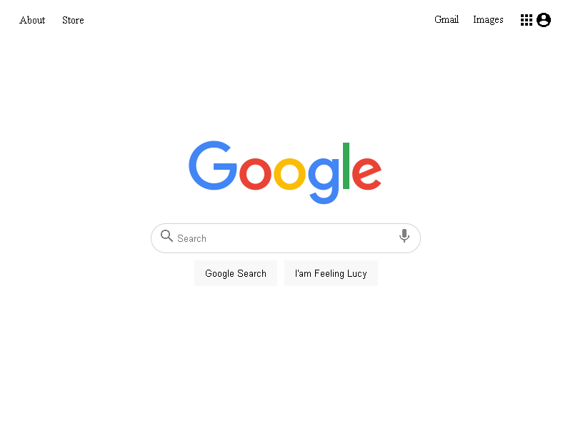

# Google Clone

> I made this google clone for the Odin project with HTML and CSS

## Built With

- HTML
- CSS

## Live Demo

[Live Demo Link](https://livedemo.com)

## Getting Started

I made this google clone for the Odin project with HTML and CSS
## Authors

👤 **Author**

- GitHub: [@AtillaTahak](https://github.com/AtillaTahak)
- Twitter: [@AtillaTahaa]https://twitter.com/AtillaTahaa)
- LinkedIn: [LinkedIn](https://www.linkedin.com/in/atilla-taha-kördüğüm-a93702186/)

## Show your support

Give a ⭐️ if you like this project!

## Acknowledgments

Thank you The odin Project
## 📝 License

This project is [MIT](./MIT.md) licensed.
